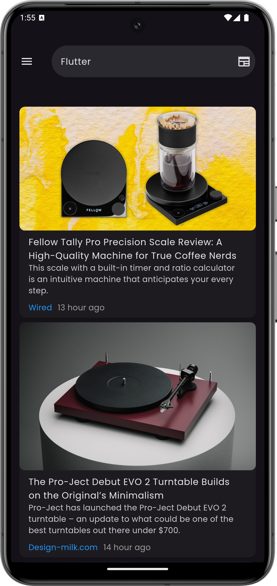
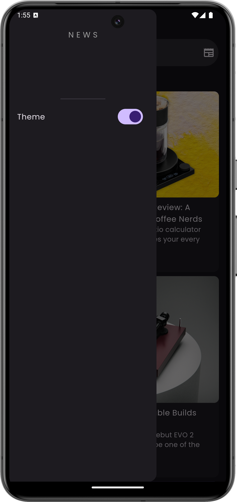
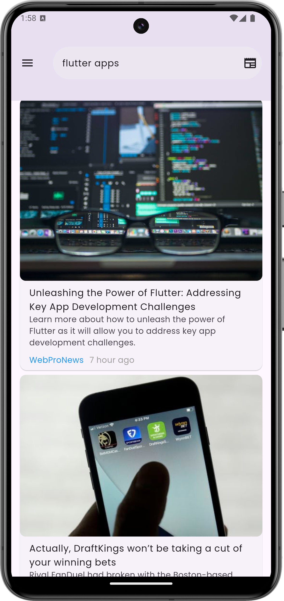
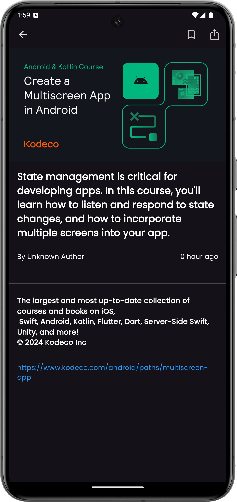

# News App

A Flutter News Application

## Features
* Get real news from api more than 150,000 news and updates daily
* Toggle between dark and light mode theme
* search your specific category or title
* provider state management
* rest api
* share news links
* open news links

# ScreenShots

## Getting Started
1. Clone the repository: git clone https://github.com/OracleMatrix/news_app.git
2. Open the project in your preferred IDE (e.g. Android Studio, Visual Studio Code)
3. Run the app on an emulator or physical device: flutter run
   A few resources to get you started if this is your first Flutter project:

- [Lab: Write your first Flutter app](https://docs.flutter.dev/get-started/codelab)
- [Cookbook: Useful Flutter samples](https://docs.flutter.dev/cookbook)

For help getting started with Flutter development, view the
[online documentation](https://docs.flutter.dev/), which offers tutorials,
samples, guidance on mobile development, and a full API reference.
